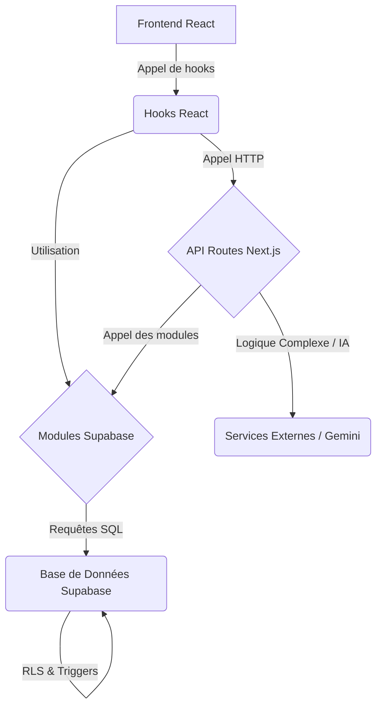

'''
# 📖 Documentation des Flux BDD → Backend

**Date** : 17 octobre 2025
**Auteur** : Manus AI

Ce document détaille l'architecture et l'utilisation des flux de données entre la base de données Supabase et le backend Next.js pour le projet **BilanCompetence.AI v2**.

## 1. Architecture Générale

L'accès aux données est structuré en 3 couches principales pour garantir la modularité, la sécurité et la facilité d'utilisation :

1.  **Types TypeScript** : Une représentation statique et typée de la base de données, générée automatiquement.
2.  **Modules Supabase** : Des fonctions utilitaires regroupées par fonctionnalité (compétences, RDV, etc.) qui encapsulent la logique d'accès aux données (CRUD).
3.  **API Routes Next.js** : Des points d'entrée sécurisés pour les opérations complexes, notamment celles nécessitant une logique serveur ou l'intervention de l'IA (Gemini).



## 2. Types TypeScript (`src/types/database.types.ts`)

Ce fichier est la **source de vérité** pour la structure de la base de données dans le code. Il contient :

-   **`Tables<T>`** : Pour obtenir le type d'une ligne d'une table (ex: `Tables<'bilans'>`).
-   **`Inserts<T>`** : Pour typer les objets à insérer (ex: `Inserts<'competences'>`).
-   **`Updates<T>`** : Pour typer les objets de mise à jour (ex: `Updates<'rdv'>`).
-   **Enums** : Tous les types `enum` de la base de données (ex: `UserRole`, `BilanStatus`).

### Utilisation

```typescript
import type { Tables, Inserts } from '@/types/database.types';

// Récupérer le type d'un bilan complet
type Bilan = Tables<'bilans'>;

// Typer une nouvelle compétence à créer
const nouvelleCompetence: Inserts<'competences'> = {
  bilan_id: '...',
  nom: 'Gestion de projet Agile',
  categorie: 'transversale',
  source: 'manuelle',
};
```

> **Note** : Ce fichier a été entièrement mis à jour pour inclure les **22 tables** et toutes les nouvelles colonnes, fonctions et vues de la base de données.

## 3. Modules Supabase (`src/lib/supabase/modules/`)

Pour simplifier et sécuriser l'accès aux données, **6 modules** ont été créés. Chaque module expose un ensemble de fonctions asynchrones pour interagir avec une partie spécifique de la base de données.

| Module | Fichier | Description |
| :--- | :--- | :--- |
| **Compétences** | `competences/index.ts` | Gestion du profil de talents (compétences, expériences). |
| **Pistes Métiers**| `pistes-metiers/index.ts`| Gestion du simulateur de carrière (pistes, écarts, formations). |
| **Plan d'Action**| `plan-action/index.ts` | Gestion du plan d'action interactif (Kanban). |
| **RDV** | `rdv/index.ts` | Gestion des rendez-vous et des notes d'entretien. |
| **Notifications**| `notifications/index.ts`| Gestion du système de notifications multi-canaux. |
| **Qualiopi** | `qualiopi/index.ts` | Gestion de la conformité (enquêtes, réclamations, veille). |

Un fichier `index.ts` centralise l'export de tous ces modules pour une importation facile.

### Utilisation

```typescript
import { competences, planAction } from '@/lib/supabase/modules';

// Récupérer toutes les compétences d'un bilan
async function handleGetCompetences(bilanId: string) {
  try {
    const competencesList = await competences.getCompetences(bilanId);
    console.log(competencesList);
  } catch (error) {
    console.error('Erreur:', error);
  }
}

// Changer le statut d'une action dans le Kanban
async function handleMoveAction(actionId: string) {
  try {
    const updatedAction = await planAction.changeActionStatut(actionId, 'en_cours');
    console.log('Action déplacée:', updatedAction);
  } catch (error) {
    console.error('Erreur:', error);
  }
}
```

## 4. API Routes Next.js (`src/app/api/`)

Pour les opérations nécessitant une logique serveur (sécurité avancée, calculs complexes) ou l'appel à des services externes comme l'IA Gemini, des API Routes dédiées ont été créées.

| Route | Méthode | Description |
| :--- | :--- | :--- |
| `/api/competences/extract` | `POST` | **(IA)** Extrait les compétences d'un texte de CV. |
| `/api/pistes-metiers/suggest` | `POST` | **(IA)** Suggère des pistes métiers basées sur le profil complet. |
| `/api/pistes-metiers/gap-analysis`| `POST` | **(IA)** Génère une analyse d'écart (Gap Analysis) pour une piste. |
| `/api/formations/suggest` | `POST` | **(IA)** Suggère des formations pour combler les écarts. |

Ces routes sont sécurisées et ne peuvent être appelées que par un utilisateur authentifié ayant les permissions nécessaires sur le bilan concerné.

### Utilisation

Les modules Supabase contiennent déjà des fonctions qui appellent ces API routes pour vous.

```typescript
import { competences, pistesMetiers } from '@/lib/supabase/modules';

// Extraire les compétences d'un CV
async function handleExtract(bilanId: string, cvText: string) {
  try {
    const result = await competences.extractCompetencesFromCV(bilanId, cvText);
    console.log(`Extraction de ${result.count} compétences réussie !`);
  } catch (error) {
    console.error('Erreur d\'extraction:', error);
  }
}

// Suggérer des pistes métiers
async function handleSuggestPistes(bilanId: string) {
  try {
    const result = await pistesMetiers.suggestPistesMetiers(bilanId);
    console.log(`Suggestion de ${result.count} pistes métiers.`);
    console.log('Analyse IA:', result.analyse);
  } catch (error) {
    console.error('Erreur de suggestion:', error);
  }
}
```

## 5. Prochaines Étapes

Avec ces flux en place, les prochaines étapes de développement sont :

1.  **Créer les hooks React** (ex: `useCompetences`, `usePlanAction`) qui utiliseront ces modules pour récupérer et mettre à jour les données depuis les composants du frontend.
2.  **Développer les interfaces utilisateur** qui consommeront ces hooks pour afficher et interagir avec les données.
3.  **Tester de bout en bout** chaque fonctionnalité pour valider l'intégration complète.

Ce socle technique robuste et modulaire est prêt à supporter le développement de toutes les fonctionnalités prévues dans le cahier des charges.
'''
